<div align="center">
	<h1>🌟 ASTEX Teleports — Unicore</h1>
	
	<p>Teleportes para <em>Genshin Impact</em> otimizarem rotas, economizarem tempo e melhorarem sua experiência — versão compatível com <strong>Unicore</strong>.</p>
	
	
	<a href="https://discord.gg/zDCvwFuBu7"></a>
</div>

---
> ✅ Você está na branch <strong>unicore</strong> (arquivos compatíveis com Unicore).
>
> Se usa <strong>Akebi</strong>, veja a branch <a href="https://github.com/gabszap/astex-teleports/tree/main"><code>main</code></a>.
---

## 📜 Sumário

- [Sobre](#-sobre)
- [Como Baixar o Repositório](#-como-baixar-o-repositório)
- [Exploração](#-exploração)
	- [Baús](#baús)
- [Farming](#-farming)
	- [Oculi](#oculi)
	- [Especialidades](#-especialidades)
		- [Mondstadt](#mondstadt)
		- [Liyue](#liyue)
		- [Inazuma](#inazuma)
		- [Sumeru](#sumeru)
		- [Fontaine](#fontaine)
		- [Natlan](#natlan)
- [Bônus de Personagens](#-bônus-de-personagens)

---
## 🌍 Sobre
Astex Teleports traduz e disponibiliza teleportes prontos para uso no <em>Genshin Impact</em>. Esta branch mantém arquivos no formato para o <strong>Unicore</strong>.

> Compatibilidade: para Akebi, use a branch <a href="https://github.com/gabszap/astex-teleports/tree/main"><code>main</code></a>.

---
## ⬇️ Como Baixar o Repositório

### 1) Download (ZIP) desta branch
1. Clique em <strong>Code</strong> > <strong>Download ZIP</strong>.
2. Extraia o arquivo ZIP. Recomendo o <a href="https://www.7-zip.org/a/7z2501-x64.exe">7‑Zip</a> para arquivos grandes.

### 2) Usando Git (recomendado)

```powershell
git clone https://github.com/gabszap/astex-teleports.git
cd astex-teleports
git switch unicore
```

Para atualizar depois:

```powershell
git pull
```

---
## 🗺️ Exploração

### 🚀 Em Alta

| Ícone | Nome | Região | Download |
|-------|------|--------|----------|
| 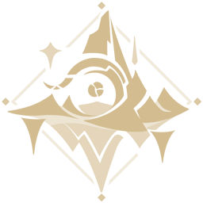 | Montanha Sagrada Antiga | Natlan | [Download](https://github.com/gabszap/astex-teleports/raw/refs/heads/storage/baus/Montanha%20sagrada.7z) |
|  | Pyroculus | Natlan | [Download](https://github.com/gabszap/astex-teleports/raw/refs/heads/storage/oculis/Pyroculus.7z) |

### Baús
> ⚠️ Não é 100% precisa. Pode haver baú faltando, repetido ou incorreto.

| Ícone | Região | Download |
|-------|--------|----------|
|  | Mondstadt | [Download](https://github.com/gabszap/astex-teleports/raw/refs/heads/storage/unicore/baus/Mondstadt.7z) |
|  | Liyue | [Download](https://github.com/gabszap/astex-teleports/raw/refs/heads/storage/unicore/baus/Liyue.7z) |
|  | Inazuma | [Download](https://github.com/gabszap/astex-teleports/raw/refs/heads/storage/unicore/baus/Inazuma.7z) |
|  | Sumeru | [Download](https://github.com/gabszap/astex-teleports/raw/refs/heads/storage/unicore/baus/Sumeru.7z) |
|  | Fontaine | [Download](https://github.com/gabszap/astex-teleports/raw/refs/heads/storage/unicore/baus/Fontaine.7z) |
|  | Natlan | [Download](https://github.com/gabszap/astex-teleports/raw/refs/heads/storage/unicore/baus/Natlan.7z) |
| 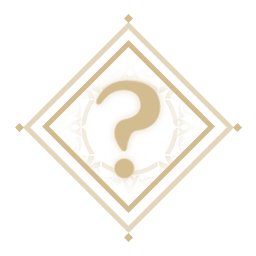 | Nod Krai | Em Breve |
|  | Enkanomiya | [Download](https://github.com/gabszap/astex-teleports/raw/refs/heads/storage/unicore/baus/Enkanomiya%20(desbloquear%20primeiro).7z) |
|  | Espinha do Dragão | [Download](https://github.com/gabszap/astex-teleports/raw/refs/heads/storage/unicore/baus/Espinha%20do%20Drag%C3%A3o.7z) |
|  | Despenhadeiro | [Download](https://github.com/gabszap/astex-teleports/raw/refs/heads/storage/unicore/baus/Despenhadeiro.7z) |
|  | Despenhadeiro: Subterrâneo | [Download](https://github.com/gabszap/astex-teleports/raw/refs/heads/storage/unicore/baus/Minas%20subterraneas%20(despenhadeiro).7z) |
| 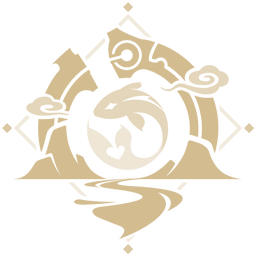 | Vale Chenyu | [Download](https://github.com/gabszap/astex-teleports/raw/refs/heads/storage/unicore/baus/Vale%20Chenyu.7z) |
| 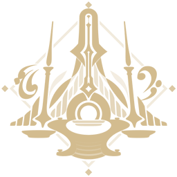 | Mar Antigo | [Download](https://github.com/gabszap/astex-teleports/raw/refs/heads/storage/unicore/baus/Mar%20Antigo.7z) |
|  | Montanha Sagrada Antiga | [Download](https://github.com/gabszap/astex-teleports/raw/refs/heads/storage/unicore/baus/Montanha%20sagrada.7z) |
| 🌎 | Todas as Regiões | [Download](https://github.com/gabszap/astex-teleports/raw/refs/heads/storage/unicore/baus/Todas%20as%20regi%C3%B5es.7z) |

<p align="right"><a href="#-sumário">⬆ Voltar ao Topo</a></p>

---

## 🌱 Farming
### Oculi

> Na Espinha do Dragão, a árvore alcança o nível 8; os extras vêm de missões a cada 3 dias.

| Ícone | Nome | Região | Download |
|-------|------|--------|----------|
|  | Anemoculus | Mondstadt | [Download](https://github.com/gabszap/astex-teleports/raw/refs/heads/storage/unicore/oculis/Anemoculus.7z) |
|  | Geoculus | Liyue | [Download](https://github.com/gabszap/astex-teleports/raw/refs/heads/storage/unicore/oculis/Geoculus.7z) |
|  | Electroculus | Inazuma | [Download](https://github.com/gabszap/astex-teleports/raw/refs/heads/storage/unicore/oculis/Electroculus.7z) |
|  | Dendroculus | Sumeru | [Download](https://github.com/gabszap/astex-teleports/raw/refs/heads/storage/unicore/oculis/Dendroculus.7z) |
|  | Hydroculus | Fontaine | [Download](https://github.com/gabszap/astex-teleports/raw/refs/heads/storage/unicore/oculis/Hydroculos.7z) |
|  | Pyroculus | Natlan | [Download](https://github.com/gabszap/astex-teleports/raw/refs/heads/storage/unicore/oculis/Pyroculus.7z) |
| 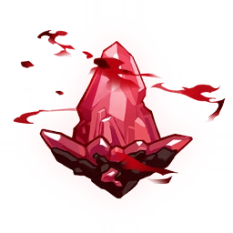 | Calcedônia Carmesim | Espinha do Dragão | [Download](https://github.com/gabszap/astex-teleports/raw/refs/heads/storage/unicore/oculis/CalcedoniaCarmesim.7z) |
|  | Espato Lúmen | Despenhadeiro: Subterrâneo | [Download](https://github.com/gabszap/astex-teleports/raw/refs/heads/storage/unicore/oculis/EspatoLumen.7z) |
|  | Minério Lúmen | Despenhadeiro: Subterrâneo | [Download](https://github.com/gabszap/astex-teleports/raw/refs/heads/storage/unicore/oculis/MinerioLumen.7z) |
| 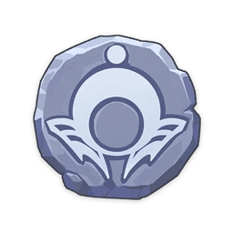 | Padrões de Chave | Enkanomiya | [Download](https://github.com/gabszap/astex-teleports/raw/refs/heads/storage/unicore/oculis/Padr%C3%B5es%20de%20chave.7z) |
| 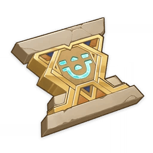 | Selo Sagrado | Sumeru: Deserto | [Download](https://github.com/gabszap/astex-teleports/raw/refs/heads/storage/unicore/oculis/Selo%20Sagrado.7z) |
|  | Carpa Espiritual | Vale Chenyu | [Download](https://github.com/gabszap/astex-teleports/raw/refs/heads/storage/unicore/oculis/Carpa%20Espiritual.7z) |
|  | Aranaras | Sumeru | [Download](https://github.com/gabszap/astex-teleports/raw/refs/heads/storage/oculis/Aranaras.7z) |

> Observações:
> - Minério Lúmen: usado para aumentar o nível da Lanterna Lúmen.
> - Padrões de Chave: conclua Enkanomiya antes de coletá-los. Onde usar: <a href="https://youtu.be/_ES5BTwIp_M?si=IapwxOCtptDzCO-A">YouTube</a>.
> - Selo Sagrado: sem uso prático conhecido por aqui.

<p align="right"><a href="#-sumário">⬆ Voltar ao Topo</a></p>

### Especialidades
Farme especialidades regionais para ascensão e missões.

<details>
<summary><strong>🗺️ Mondstadt</strong></summary>

| Ícone | Nome | Download |
|-------|------|----------|
|  | Lótus de Leite | [Download](https://github.com/gabszap/astex-teleports/raw/refs/heads/storage/unicore/especialidades/Lótus%20de%20Leite.7z) |
|  | Cecília | [Download](https://github.com/gabszap/astex-teleports/raw/refs/heads/storage/unicore/especialidades/Cecília.7z) |
|  | Semente de Dandelion | [Download](https://github.com/gabszap/astex-teleports/raw/refs/heads/storage/unicore/especialidades/Sementes%20de%20Dandelion.7z) |
|  | Cogumelo Philanemo | [Download](https://github.com/gabszap/astex-teleports/raw/refs/heads/storage/unicore/especialidades/Cogumelo%20Philanemo.7z) |
|  | Lâmpada de Grama | [Download](https://github.com/gabszap/astex-teleports/raw/refs/heads/storage/unicore/especialidades/Lâmpada%20de%20Grama.7z) |
|  | Valberry | [Download](https://github.com/gabszap/astex-teleports/raw/refs/heads/storage/unicore/especialidades/Valberry.7z) |
|  | Margaridas Voadoras | [Download](https://github.com/gabszap/astex-teleports/raw/refs/heads/storage/unicore/especialidades/Margaridas%20Voadoras.7z) |
|  | Gancho do Lobo | [Download](https://github.com/gabszap/astex-teleports/raw/refs/heads/storage/unicore/especialidades/Gancho%20do%20Lobo.7z) |
</details>

<details>
<summary><strong>🏯 Liyue</strong></summary>

| Ícone | Nome | Download |
|-------|------|----------|
|  | Jade Cristalino | [Download](https://github.com/gabszap/astex-teleports/raw/refs/heads/storage/unicore/especialidades/Jade%20Cristalino.7z) |
|  | Cor Lapis | [Download](https://github.com/gabszap/astex-teleports/raw/refs/heads/storage/unicore/especialidades/Cor%20Lapis.7z) |
|  | Lírio de Vidro | [Download](https://github.com/gabszap/astex-teleports/raw/refs/heads/storage/unicore/especialidades/Lírio%20de%20Vidro.7z) |
|  | Pimenta de Jueyun | [Download](https://github.com/gabszap/astex-teleports/raw/refs/heads/storage/unicore/especialidades/Pimenta%20de%20Jueyun.7z) |
|  | Jade Noctilucosa | [Download](https://github.com/gabszap/astex-teleports/raw/refs/heads/storage/unicore/especialidades/Jade%20Nocticulosa.7z) |
|  | Qingxin | [Download](https://github.com/gabszap/astex-teleports/raw/refs/heads/storage/unicore/especialidades/Qingxin.7z) |
|  | Flor de Seda | [Download](https://github.com/gabszap/astex-teleports/raw/refs/heads/storage/unicore/especialidades/Flor%20de%20Seda.7z) |
|  | Concha Estrelada | [Download](https://github.com/gabszap/astex-teleports/raw/refs/heads/storage/unicore/especialidades/Conchas%20Estreladas.7z) |
|  | Violeta | [Download](https://github.com/gabszap/astex-teleports/raw/refs/heads/storage/unicore/especialidades/Violeta.7z) |
</details>

<details>
<summary><strong>⚡️ Inazuma</strong></summary>

| Ícone | Nome | Download |
|-------|------|----------|
|  | Fruto Amakumo | [Download](https://github.com/gabszap/astex-teleports/raw/refs/heads/storage/unicore/especialidades/Fruto%20Tenkumo.7z) |
|  | Medula de Cristal | [Download](https://github.com/gabszap/astex-teleports/raw/refs/heads/storage/unicore/especialidades/Medula%20de%20Cristal.7z) |
|  | Dendróbio | [Download](https://github.com/gabszap/astex-teleports/raw/refs/heads/storage/unicore/especialidades/Dendróbio.7z) |
|  | Cogumelo Fluorescente | [Download](https://github.com/gabszap/astex-teleports/raw/refs/heads/storage/unicore/especialidades/Fungos%20Fluorescentes.7z) |
|  | Erva Naku | [Download](https://github.com/gabszap/astex-teleports/raw/refs/heads/storage/unicore/especialidades/Erva%20Naku.7z) |
|  | Onikabuto | [Download](https://github.com/gabszap/astex-teleports/raw/refs/heads/storage/unicore/especialidades/Onikabuto.7z) |
|  | Flor de Sakura | [Download](https://github.com/gabszap/astex-teleports/raw/refs/heads/storage/unicore/especialidades/Pétalas%20da%20Flor%20de%20Sakura.7z) |
|  | Pérola Sango | [Download](https://github.com/gabszap/astex-teleports/raw/refs/heads/storage/unicore/especialidades/Pérola%20Sango.7z) |
|  | Fungos Marítimos | [Download](https://github.com/gabszap/astex-teleports/raw/refs/heads/storage/unicore/especialidades/Fungos%20Marítimos.7z) |
</details>

<details>
<summary><strong>🌿 Sumeru</strong></summary>

| Ícone | Nome | Download |
|-------|------|----------|
|  | Baga de Espinheiro | [Download](https://github.com/gabszap/astex-teleports/raw/refs/heads/storage/unicore/especialidades/Bagas%20de%20Espinheiro.7z) |
|  | Lótus Kalpalata | [Download](https://github.com/gabszap/astex-teleports/raw/refs/heads/storage/unicore/especialidades/Lótus%20Kalpalata.7z) |
|  | Flor do Luto | [Download](https://github.com/gabszap/astex-teleports/raw/refs/heads/storage/unicore/especialidades/Flor%20do%20Luto.7z) |
|  | Lótus Nilotpala | [Download](https://github.com/gabszap/astex-teleports/raw/refs/heads/storage/unicore/especialidades/Lótus%20Nilotpala.7z) |
|  | Padisarah | [Download](https://github.com/gabszap/astex-teleports/raw/refs/heads/storage/unicore/especialidades/Padisarah.7z) |
|  | Cogumelo Rukkhashava | [Download](https://github.com/gabszap/astex-teleports/raw/refs/heads/storage/unicore/especialidades/Cogumelo%20Rukkhashava.7z) |
|  | Pupa de Gordura de Areia | [Download](https://github.com/gabszap/astex-teleports/raw/refs/heads/storage/unicore/especialidades/Pupa%20de%20Gordura%20de%20Areia.7z) |
|  | Escaravelho Dourado | [Download](https://github.com/gabszap/astex-teleports/raw/refs/heads/storage/unicore/especialidades/Escaravelho%20Dourado.7z) |
|  | Trishiraite | [Download](https://github.com/gabszap/astex-teleports/raw/refs/heads/storage/unicore/especialidades/Trishiraita.7z) |
</details>

<details>
<summary><strong>💧 Fontaine</strong></summary>

| Ícone | Nome | Download |
|-------|------|----------|
|  | Concha de Cristal Azul | [Download](https://github.com/gabszap/astex-teleports/raw/refs/heads/storage/unicore/especialidades/Concha%20de%20Cristal%20Azul.7z) |
|  | Flor da Luz do Lago | [Download](https://github.com/gabszap/astex-teleports/raw/refs/heads/storage/unicore/especialidades/Flor%20da%20Luz%20do%20Lago.7z) |
|  | Campânula Lumidouce | [Download](https://github.com/gabszap/astex-teleports/raw/refs/heads/storage/unicore/especialidades/Campânula%20Lumidouce.7z) |
|  | Lumitoile | [Download](https://github.com/gabszap/astex-teleports/raw/refs/heads/storage/unicore/especialidades/lumitoile.7z) |
|  | Rosa Arco-Íris | [Download](https://github.com/gabszap/astex-teleports/raw/refs/heads/storage/unicore/especialidades/Rosa%20Arco-Íris.7z) |
|  | Flor Romaritime | [Download](https://github.com/gabszap/astex-teleports/raw/refs/heads/storage/unicore/especialidades/Flor%20Rociomarinha.7z) |
|  | Primavera do Primeiro Orvalho | [Download](https://github.com/gabszap/astex-teleports/raw/refs/heads/storage/unicore/especialidades/Primavera%20do%20Primeiro%20Orvalho.7z) |
|  | Unidade de Subdetecção | [Download](https://github.com/gabszap/astex-teleports/raw/refs/heads/storage/unicore/especialidades/Unidade%20de%20Subdetec%C3%A7%C3%A3o.7z) |
</details>

<details>
<summary><strong>🔥 Natlan</strong></summary>

| Ícone | Nome | Download |
|-------|------|----------|
|  | Crisântemo Brilhante | [Download](https://github.com/gabszap/astex-teleports/raw/refs/heads/storage/unicore/especialidades/Crisântemo%20Brilhante.7z) |
|  | Dracolita | [Download](https://github.com/gabszap/astex-teleports/raw/refs/heads/storage/unicore/especialidades/Dracolita.7z) |
|  | Cogumelo Brilhante | [Download](https://github.com/gabszap/astex-teleports/raw/refs/heads/storage/especialidades/Cogumelo%20Brilhante.7z) |
|  | Baga Quenepa | [Download](https://github.com/gabszap/astex-teleports/raw/refs/heads/storage/especialidades/Baga%20Quenepa.7z) |
|  | Suculenta de Garra Sauriana | [Download](https://github.com/gabszap/astex-teleports/raw/refs/heads/storage/especialidades/Suculenta%20de%20Garra%20Sauriana.7z) |
|  | Guelra da Espuma | [Download](https://github.com/gabszap/astex-teleports/raw/refs/heads/storage/especialidades/Guelra%20da%20Espuma.7z) |
|  | Flor Púrpura Definhada | [Download](https://github.com/gabszap/astex-teleports/raw/refs/heads/storage/especialidades/Flor%20Púrpura%20Definhada.7z) |
|  | Florgema Celeste | [Download](https://github.com/gabszap/astex-teleports/raw/refs/heads/storage/especialidades/Florgema%20Celeste.7z) |

</details>

<p align="right"><a href="#-sumário">⬆ Voltar ao Topo</a></p>

---

## 🎯 Bônus de Personagens

Alguns personagens mostram especialidades no minimapa com um <strong>ícone de mão</strong> .

| Personagem | Raridade | Região   | Especialidades Locais |
|:----------:|:--------:|:--------:|:---------------------:|
| 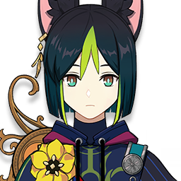<br/>Tighnari | 5★ | Sumeru |          |
| <br/>Sethos | 4★ | Sumeru |          |
| 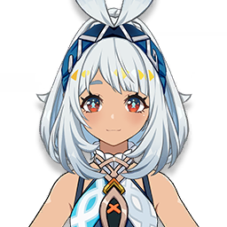<br/>Mualani | 5★ | Natlan |         |
| 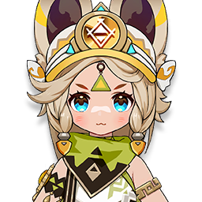<br/>Kachina | 4★ | Natlan |         |
| 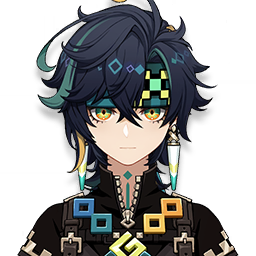<br/>Kinich | 5★ | Natlan |         |
| <br/>Klee | 5★ | Mondstadt |         |
| <br/>Mika | 4★ | Mondstadt |         |
| <br/>Qiqi | 5★ | Liyue |          |
| <br/>Yanfei | 4★ | Liyue |          |
| 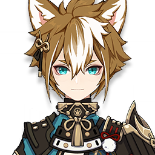<br/>Gorou | 4★ | Inazuma |          |
| <br/>Lyney | 5★ | Fontaine |         |
| <br/>Clorinde | 5★ | Fontaine |         |

---

## 🤝 Créditos

- Colaboradores: [@gabszap](https://github.com/gabszap), [@marcoshsw](https://github.com/marcoshsw), [@termux](https://github.com/termuxcay)
- Banner: [@marcoshsw](https://github.com/marcoshsw)
- Fontes: Adwin (unicore discord)

<p align="right"><a href="#-sumário">⬆ Voltar ao Topo</a></p>

<div align="center">

> ⭐ <strong>Se este projeto foi útil, deixe uma estrela!</strong> Seu apoio ajuda a manter o conteúdo atualizado.

---
<div align="center">
	<p>Boa exploração, Viajante! 🚪✨</p>
</div>

