

  <h1>🌟 ASTEX Teleports</h1>
  
  
A collection of teleports for <em>Genshin Impact</em> to optimize routes, save time, and enhance your gaming experience.
  

    
    
    
    <!--  -->

  <b>This readme is available in:</b> 
  
  

> **Note:** This readme was translated from Portuguese to English using AI. While efforts have been made for accuracy, some nuances or errors might exist.

---

## 📜 Table of Contents
- [About](#-about)
- [How to Search](#-how-to-search)
- [Exploration](#-exploration)
  - [Chests](#chests)
- [Farming](#-farming)
  - [Oculi](#oculi)
  - [Specialties](#specialties)
    - [Mondstadt](#mondstadt)
    - [Liyue](#liyue)
    - [Inazuma](#inazuma)
    - [Sumeru](#sumeru)
    - [Fontaine](#fontaine)
    - [Natlan](#natlan)
- [Character Bonuses](#-character-bonuses)

---

## 🌍 About
Astex Teleports is a project dedicated to the *Genshin Impact* community, created to simplify your gameplay. This guide offers teleports to reduce repetitive routes, helping you farm efficiently and explore with ease.

---

## 🔍 How to Search
To quickly find what you need:
1. Press `Ctrl + F`.
2. Type your search query in the search bar.
3. For best results, avoid hyphens (e.g., search `sweet` instead of `sweet-flower`).

> 💡 **Tip**: Use simple keywords like `chest`, `oculus`, or `specialty` for faster results.

---

## 🗺️ Exploration

### Chests
> ⚠️ **Note:** The list of chests is not 100% accurate! There might be missing, duplicate, or even incorrect chests.

| Icon | Region | Download |
|-------|--------|----------|
|  | Mondstadt | [Download](https://raw.githubusercontent.com/gabszap/json-beta/main/download/Mondstadt.rar?raw=true) |
|  | Liyue | [Download](https://raw.githubusercontent.com/gabszap/json-beta/main/download/Liyue.rar?raw=true) |
|  | Inazuma | [Download](https://raw.githubusercontent.com/gabszap/json-beta/main/download/Inazuma.rar?raw=true) |
| 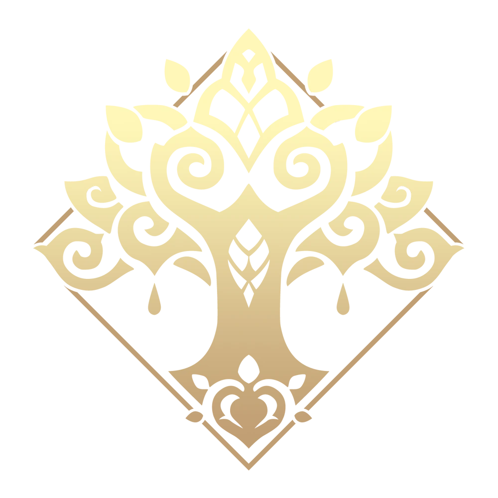 | Sumeru | [Download](https://raw.githubusercontent.com/gabszap/json-beta/main/download/Sumeru.rar?raw=true) |
| 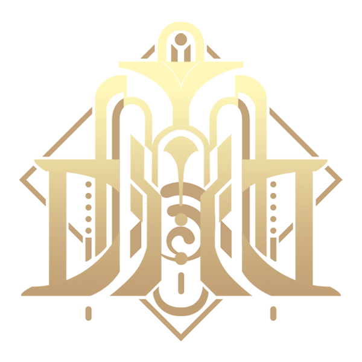 | Fontaine | [Download](https://raw.githubusercontent.com/gabszap/json-beta/main/download/Fontaine%204.0-4.6.rar?raw=true) |
| 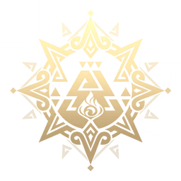 | Natlan | [Download](https://raw.githubusercontent.com/gabszap/json-beta/main/download/Natlan.rar?raw=true) |
|  | Enkanomiya | [Download](https://raw.githubusercontent.com/gabszap/json-beta/main/download/Enkanomiya%20(desbloquear%20primeiro).rar?raw=true) |
| 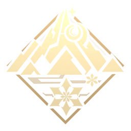 | Dragonspine | [Download](https://raw.githubusercontent.com/gabszap/json-beta/main/download/Dragonspine.rar?raw=true) |
| 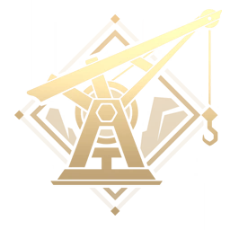 | The Chasm | [Download](https://raw.githubusercontent.com/gabszap/json-beta/main/download/Despenhadeiro.rar?raw=true) |
|  | The Chasm: Underground | [Download](https://raw.githubusercontent.com/gabszap/json-beta/main/download/Minas%20subterraneas%20(despenhadeiro).rar?raw=true) |
|  | Chenyu Vale | [Download](https://raw.githubusercontent.com/gabszap/json-beta/main/download/Vale%20Chenyu.rar?raw=true) |

<a href="#-table-of-contents">⬆ Back to Top</a>

---

## 🌱 Farming
### Oculi

> **Note**: In *Genshin Impact* 5.6, there are **222 Pyroculi** in Natlan, allowing the Statue of The Seven to reach level 8 with 30/38 collected. In Dragonspine, Crimson Agate reaches level 8; the extras are obtained from quests every 3 days.

| Icon | Name | Region | Download |
|-------|------|--------|----------|
|  | Anemoculus | Mondstadt | [Download](https://raw.githubusercontent.com/gabszap/json-beta/main/download/Anemoculus.rar) |
|  | Geoculus | Liyue | [Download](https://raw.githubusercontent.com/gabszap/json-beta/main/download/Geoculus.rar) |
| 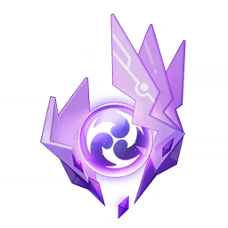 | Electroculus | Inazuma | [Download](https://raw.githubusercontent.com/gabszap/json-beta/main/download/Electroculus.rar) |
|  | Dendroculus | Sumeru | [Download](https://raw.githubusercontent.com/gabszap/json-beta/main/download/Dendroculus.rar) |
| 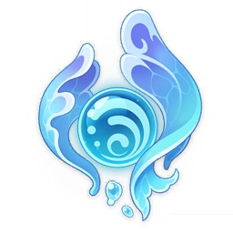 | Hydroculus | Fontaine | [Download](https://raw.githubusercontent.com/Gabriel4927/json-paradise/raw/main/download/Hydroculus.rar) |
| 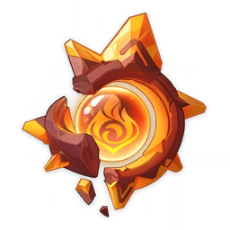 | Pyroculus | Natlan | [Download](https://raw.githubusercontent.com/Gabriel4927/json-paradise/raw/main/download/Pyroculus.rar) |
|  | Crimson Agate	 | Dragonspine | [Download](https://raw.githubusercontent.com/Gabriel4927/json-paradise/blob/main/download/CalcedoniaCarmesim.rar) |
| 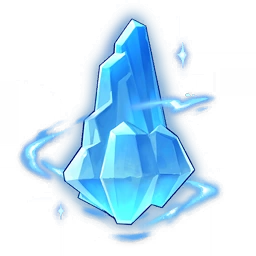 | Lumenspar | The Chasm: Underground | [Download](https://raw.githubusercontent.com/Gabriel4927/json-paradise/raw/main/download/EspatoLumen.rar) |
|  | Lumenstone Ore | The Chasm: Underground | [Download](https://raw.githubusercontent.com/Gabriel4927/json-paradise/raw/main/download/MinerioLumen.rar) |
|  | Key Sigils | Enkanomiya | [Download](https://raw.githubusercontent.com/Gabriel4927/json-paradise/raw/main/download/Padr%C3%B5es%20de%20chave.rar) |
|  | Sacred Seal | Sumeru: Desert | [Download](https://raw.githubusercontent.com/Gabriel4927/json-paradise/raw/main/download/Selo%20Sagrado.rar) |
|  | Spirit Carp | Chenyu Vale | [Download](https://raw.githubusercontent.com/Gabriel4927/json-paradise/raw/main/download/Carpa_Espiritual.rar) |

> **Notes**:
> - **Lumenstone Ore**: Used to upgrade the Lumenstone Adjuvant.
> - **Key Sigils**: Complete all Enkanomiya quests before collecting them. See where to use them: [YouTube](https://youtu.be/_ES5BTwIp_M?si=IapwxOCtptDzCO-A).
> - **Sacred Seal**: The purpose of this item is not clearly documented here.

<a href="#-table-of-contents">⬆ Back to Top</a>

### Specialties
Farm regional specialties for character ascension and quests.

<strong>🗺️ Mondstadt</strong>

| Icon | Name | Download |
|-------|------|----------|
|  | Calla Lily | [Download](https://github.com/Gabriel4927/json-paradise/raw/main/download/Especialidades/Calla_Lily.rar) |
|  | Cecilia | [Download](https://github.com/Gabriel4927/json-paradise/raw/main/download/Especialidades/Cecilia.rar) |
| 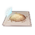 | Dandelion Seed | [Download](https://github.com/Gabriel4927/json-paradise/raw/main/download/Especialidades/Dandelion_Seed.rar) |
|  | Philanemo Mushroom | [Download](https://github.com/Gabriel4927/json-paradise/raw/main/download/Especialidades/Philanemo_Mushroom.rar) |
| 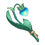 | Small Lamp Grass | [Download](https://github.com/Gabriel4927/json-paradise/raw/main/download/Especialidades/Small_Lamp_Grass.rar) |
|  | Valberry | [Download](https://github.com/Gabriel4927/json-paradise/raw/main/download/Especialidades/Valberry.rar) |
|  | Windwheel Aster | [Download](https://github.com/Gabriel4927/json-paradise/raw/main/download/Especialidades/Windwheel_Aster.rar) |
| 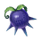 | Wolfhook | [Download](https://github.com/Gabriel4927/json-paradise/raw/main/download/Especialidades/Wolfhook.rar) |

<strong>🏯 Liyue</strong>

| Icon | Name | Download |
|-------|------|----------|
| 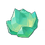 | Clearwater Jade | [Download](https://github.com/Gabriel4927/json-paradise/raw/main/download/Especialidades/Clearwater_Jade.rar) |
|  | Cor Lapis | [Download](https://github.com/Gabriel4927/json-paradise/raw/main/download/Especialidades/Cor_Lapis.rar) |
| 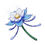 | Glaze Lily | [Download](https://github.com/Gabriel4927/json-paradise/raw/main/download/Especialidades/Glaze_Lily.rar) |
| 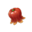 | Jueyun Chili | [Download](https://github.com/Gabriel4927/json-paradise/raw/main/download/Especialidades/Jueyun_Chili.rar) |
|  | Noctilucous Jade | [Download](https://github.com/Gabriel4927/json-paradise/raw/main/download/Especialidades/Noctilucous_Jade.rar) |
|  | Qingxin | [Download](https://github.com/Gabriel4927/json-paradise/raw/main/download/Especialidades/Qingxin.rar) |
| 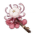 | Silk Flower | [Download](https://github.com/Gabriel4927/json-paradise/raw/main/download/Especialidades/Silk_Flower.rar) |
|  | Starconch | [Download](https://github.com/Gabriel4927/json-paradise/raw/main/download/Especialidades/Starconch.rar) |
|  | Violetgrass | [Download](https://github.com/Gabriel4927/json-paradise/raw/main/download/Especialidades/Violetgrass.rar) |

<strong>⚡️ Inazuma</strong>

| Icon | Name | Download |
|-------|------|----------|
|  | Amakumo Fruit | [Download](https://github.com/Gabriel4927/json-paradise/raw/main/download/Especialidades/Amakumo_Fruit.rar) |
|  | Crystal Marrow | [Download](https://github.com/Gabriel4927/json-paradise/raw/main/download/Especialidades/Crystal_Marrow.rar) |
|  | Dendrobium | [Download](https://github.com/Gabriel4927/json-paradise/raw/main/download/Especialidades/Dendrobium.rar) |
|  | Fluorescent Fungus | [Download](https://github.com/Gabriel4927/json-paradise/raw/main/download/Especialidades/Fluorescent_Fungus.rar) |
|  | Naku Weed | [Download](https://github.com/Gabriel4927/json-paradise/raw/main/download/Especialidades/Naku_Weed.rar) |
| 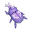 | Onikabuto | [Download](https://github.com/Gabriel4927/json-paradise/raw/main/download/Especialidades/Onikabuto.rar) |
|  | Sakura Bloom | [Download](https://github.com/Gabriel4927/json-paradise/raw/main/download/Especialidades/Sakura_Bloom.rar) |
|  | Sango Pearl | [Download](https://github.com/Gabriel4927/json-paradise/raw/main/download/Especialidades/Sango_Pearl.rar) |
| 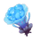 | Sea Ganoderma | [Download](https://github.com/Gabriel4927/json-paradise/raw/main/download/Especialidades/Sea_Ganoderma.rar) |

<strong>🌿 Sumeru</strong>

| Icon | Name | Download |
|-------|------|----------|
| 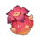 | Henna Berry | [Download](https://github.com/Gabriel4927/json-paradise/raw/main/download/Especialidades/Henna_Berry.rar) |
|  | Kalpalata Lotus | [Download](https://github.com/Gabriel4927/json-paradise/raw/main/download/Especialidades/Kalpalata_Lotus.rar) |
|  | Mourning Flower | [Download](https://github.com/Gabriel4927/json-paradise/raw/main/download/Especialidades/Mourning_Flower.rar) |
| 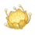 | Nilotpala Lotus | [Download](https://github.com/Gabriel4927/json-paradise/raw/main/download/Especialidades/Nilotpala_Lotus.rar) |
| 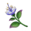 | Padisarah | [Download](https://github.com/Gabriel4927/json-paradise/raw/main/download/Especialidades/Padisarah.rar) |
| 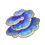 | Rukkhashava Mushrooms | [Download](https://github.com/Gabriel4927/json-paradise/raw/main/download/Especialidades/Rukkhashava_Mushrooms.rar) |
|  | Sand Grease Pupa | [Download](https://github.com/Gabriel4927/json-paradise/raw/main/download/Especialidades/Sand_Grease_Pupa.rar) |
| 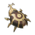 | Scarab | [Download](https://github.com/Gabriel4927/json-paradise/raw/main/download/Especialidades/Scarab.rar) |
|  | Trishiraite | [Download](https://github.com/Gabriel4927/json-paradise/raw/main/download/Especialidades/Trishiraite.rar) |

<strong>💧 Fontaine</strong>

| Icon | Name | Download |
|-------|------|----------|
| 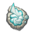 | Beryl Conch | [Download](https://github.com/Gabriel4927/json-paradise/raw/main/download/Especialidades/Beryl_Conch.rar) |
|  | Lakelight Lily | [Download](https://github.com/Gabriel4927/json-paradise/raw/main/download/Especialidades/Lakelight_Lily.rar) |
|  | Lumidouce Bell | [Download](https://github.com/Gabriel4927/json-paradise/raw/main/download/Especialidades/Lumidouce_Bell.rar) |
|  | Lumitoile | [Download](https://github.com/Gabriel4927/json-paradise/raw/main/download/Especialidades/Lumitoile.rar) |
|  | Rainbow Rose | [Download](https://github.com/Gabriel4927/json-paradise/raw/main/download/Especialidades/Rainbow_Rose.rar) |
|  | Romaritime Flower | [Download](https://github.com/Gabriel4927/json-paradise/raw/main/download/Especialidades/Romaritime_Flower.rar) |
|  | Spring of the First Dewdrop | [Download](https://github.com/Gabriel4927/json-paradise/raw/main/download/Especialidades/Spring_of_the_First_Dewdrop.rar) |
| 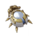 | Subdetection Unit | [Download](https://github.com/Gabriel4927/json-paradise/raw/main/download/Especialidades/Subdetection_Unit.rar) |

<strong>🔥 Natlan</strong>

| Icon | Name | Download |
|-------|------|----------|
|  | Brilliant Chrysanthemum | [Download](https://github.com/Gabriel4927/json-paradise/raw/main/download/Especialidades/Brilliant_Chrysanthemum.rar) |
|  | Dracolite | [Download](https://github.com/Gabriel4927/json-paradise/raw/main/download/Especialidades/Dracolite.rar) |
|  | Glowing Hornshroom | [Download](https://github.com/Gabriel4927/json-paradise/raw/main/download/Especialidades/Glowing_Hornshroom.rar) |
|  | Quenepa Berry | [Download](https://github.com/Gabriel4927/json-paradise/raw/main/download/Especialidades/Quenepa_Berry.rar) |
| 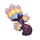 | Saurian Claw Succulent | [Download](https://github.com/Gabriel4927/json-paradise/raw/main/download/Especialidades/Saurian_Claw_Succulent.rar) |
| 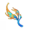 | Sprayfeather Gill | [Download](https://github.com/Gabriel4927/json-paradise/raw/main/download/Especialidades/Sprayfeather_Gill.rar) |
| 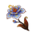 | Withering Purpurbloom | [Download](https://github.com/Gabriel4927/json-paradise/raw/main/download/Especialidades/Withering_Purpurbloom.rar) |
|  | Skysplit Gembloom | [Download](https://github.com/Gabriel4927/json-paradise/raw/main/download/Especialidades/Skysplit_Gembloom.rar) |

<a href="#-table-of-contents">⬆ Back to Top</a>

---

## 🎯 Character Bonuses

Some characters display regional specialties on the minimap with a **hand icon** 

| Character | Rarity | Region   | Local Specialties |
|:----------:|:--------:|:--------:|:---------------------:|
|  Tighnari | 5★ | Sumeru |          |
|  Sethos | 4★ | Sumeru |          |
|  Mualani | 5★ | Natlan |         |
|  Kachina | 4★ | Natlan |         |
|  Kinich | 5★ | Natlan |         |
|  Klee | 5★ | Mondstadt |         |
|  Mika | 4★ | Mondstadt |         |
|  Qiqi | 5★ | Liyue |          |
|  Yanfei | 4★ | Liyue |          |
|  Gorou | 4★ | Inazuma |          |
|  Lyney | 5★ | Fontaine |         |
|  Clorinde | 5★ | Fontaine |         |

---

## 🤝 Credits

- **Contributors:** [@gabszap](https://github.com/gabszap), [@marcoshsw](https://github.com/marcoshsw), [@termux](https://github.com/termuxcay)
- **Banner:** [@marcoshsw](https://github.com/marcoshsw)
- **Sources:** [Thafoxes](https://github.com/Thafoxes/Json_Integration/tree/upstream/eng-translate), [Minato-jsons](https://github.com/Minato0211/minato-jsons)

<a href="#-table-of-contents">⬆ Back to Top</a>

---

  
Happy exploring, Traveler! 🚪✨

